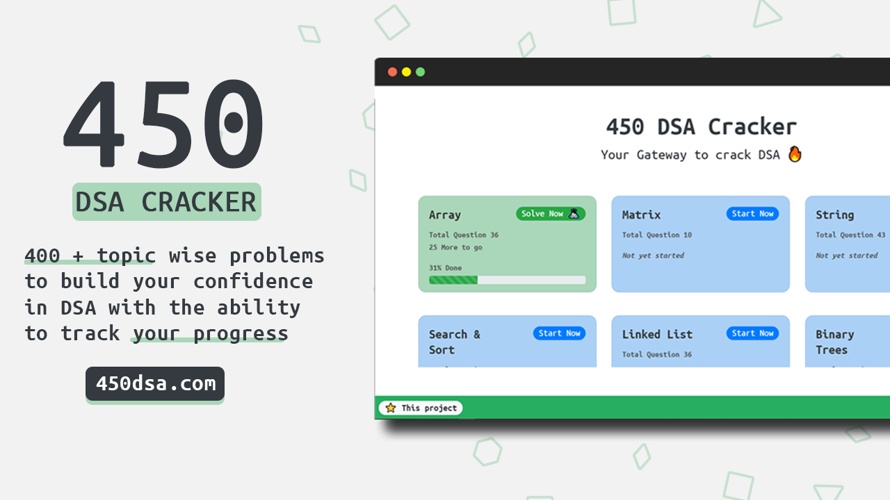

# 450-DSA Cracker 🚀

[](https://reactjs.org/)
[](https://450dsa.com/)

## Overview 👀



- **Topic wise question search 🔍**
- **Topic wise progress 🧐**
- **Complete local storage 📂**
- **Mobile first design ✌🏻**
- **Clean UI ⚡**

## What is 450-DSA Cracker 🤔

#### 450 DSA Cracker is a comprehensive list of 400 + topic wise questions to build your confidence in data structure and algorithms and prepare yourself for placements.

#### 450 DSA Cracker doesn't guarantee a job but guarantees your confidence in solving any coding problem if done in the right way 👍🏻.

#### More details on how [450dsa] can help you -> [here].

## Dependencies 🗃

- [React] - **Frontend Framework**
- [Bootstrap] - **CSS Framework**
- [React-Reveal] - **React Based Animations**
- [React-Table-2] - **Suite of table hooks**
- [LocalBase] - **Firebase style DB for offline storage**

## WIP 🛠

- ~Dark Mode~
- ~Add `bookmark` feature~
- Leader Board
- Better Responsive CSS
- Better State Management

## Run Locally 💻

```
git clone https://github.com/mohitkumhar/450-DSA.git
npm install
npm start
```

[](https://github.com/mohitkumhar/450-dsa)

## Credits 🙏🏻

#### Curated list of question in [450dsa] is based on _[DSA Cracker Sheet]_ by [Love Babbar]
